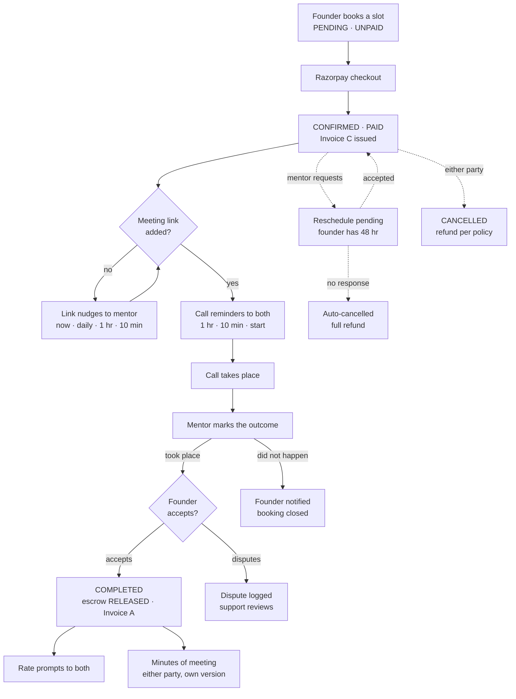

# Booking notifications, end to end

Every message a 1:1 mentor booking sends, who receives it, on which channel, what moves
the booking between states, and the places the coverage is thinner than the list suggests.

Traced from `BookingService.ts`, `src/schedule/init/`, `constants/notificationTypes.ts`
and the two notification jobs on 1 Aug 2026.

## The lifecycle

Solid arrows are the main path. Dashed arrows are the exits either party can take while
the booking is confirmed.

**The founder's acceptance is the hinge.** The mentor marking a call complete moves no
money. Escrow releases and Invoice A is raised only when the founder accepts that
confirmation, so a mentor who has delivered the call still waits on the other side.

## Every message we send

Fourteen. "both" in the Channel column means in-app and email; a single value marks a
single-channel message.

| Message | Type | Goes to | Channel | Trigger |
|---|---|---|---|---|
| **Booking & payment** | | | | |
| Booking confirmed | `BOOKING_CONFIRMED` | both | both | Razorpay payment verified |
| Call rescheduled & confirmed | `BOOKING_CONFIRMED` | both | both | Founder accepts a reschedule |
| **Before the call** | | | | |
| Meeting link added / updated | `MEETING_LINK_ADDED` | founder | both | Mentor saves a link |
| Meeting link requested | `MEETING_LINK_REQUESTED` | mentor | both | Founder asks, within 2 hr of the call |
| Please add a meeting link | `MEETING_LINK_REMINDER` | mentor | email | Cron, only while no link exists |
| Your call starts soon | `BOOKING_CALL_REMINDER` | both | both | Cron at 1 hr, 10 min and start time |
| **Reschedule & cancellation** | | | | |
| Reschedule requested | `BOOKING_RESCHEDULE_REQUESTED` | founder | both | Mentor requests a new time |
| 1:1 call cancelled | `BOOKING_CANCELLED` | both | both | Either party cancels |
| Cancelled — no response | `BOOKING_CANCELLED` | both | both | Cron, 48 hr reschedule window lapses |
| **After the call** | | | | |
| Mark your call complete | `BOOKING_COMPLETE_REMINDER` | mentor | email | Cron, once the call end time passes |
| Meeting confirmation received | `BOOKING_COMPLETED` | founder | both | Mentor confirms the call happened |
| Call did not take place | `BOOKING_COMPLETED` | founder | both | Mentor reports a no-show |
| Founder disputed the confirmation | `BOOKING_RATE_PROMPT` | mentor | in-app | Founder rejects the confirmation |
| Rate your call | `BOOKING_RATE_PROMPT` | both | both | Founder accepts — booking completes |

Eleven go to both channels, two are email-only, one is in-app only. Four of the fourteen
are sent by a cron rather than a user action.

**Channel is not configured anywhere.** It is whatever the call site happens to dispatch —
`NotificationJob` for in-app, `NotificationEmailJob` for email, usually both in sequence.
Nothing enforces the pair, which is why three rows above are uneven.

## Who moves what

| Transition | Actor | Requires |
|---|---|---|
| → `PENDING` | founder | Slot at least 2 hr 15 min out, within the mentor's duration range |
| → `CONFIRMED` | founder · Razorpay | Payment verified. Invoice C raised, escrow funded |
| → reschedule pending | mentor | Reason required. Founder has 48 hr, capped at the call time |
| → `CONFIRMED` (new row) | founder | Accepts the reschedule. Duration locked to the original |
| → `CANCELLED` | either · system | Refund depends on who and when. Auto-cancel on a lapsed reschedule |
| → mentor-confirmed | mentor | Marks the call as happened or not. Moves no money |
| → `COMPLETED` | founder | Accepts. Escrow releases, Invoice A raised, both get rate prompts |
| → disputed | founder | Rejects the confirmation. Reason and remark optional, support reviews |

## The windows

| Window | Value | Meaning |
|---|---|---|
| Minimum notice | 2 hr 15 min | Earliest a founder can book from now |
| Reschedule response | 48 hr | Founder's time to answer, capped at the call time |
| Late cancel | 24 hr | Inside this, a founder cancelling forfeits the fee |
| Link request | 2 hr | When the founder's "request link" button unlocks |

Refunds: the mentor cancelling is always a full refund, a founder cancelling 24 hr or more
ahead is a full refund, a founder cancelling inside 24 hr gets nothing, and an auto-cancel
after a lapsed reschedule is a full refund.

## The scheduled jobs that touch this

All four run in the `scaledux-schedule` container, not in `app`, and dedupe through
`BookingActivity` rows so a restart never re-sends.

| Task | Cadence | Fires at | Condition |
|---|---|---|---|
| `booking-call-reminder` | `*/2 * * * *` | 1 hr · 10 min · start time | Confirmed booking, link or no link |
| `meeting-link-reminder` | `*/2 * * * *` | On confirm · daily · 1 hr · 10 min | Only while `meeting_link` is null |
| `booking-completion-reminder` | `*/2 * * * *` | Once, as the call ends | Not yet marked complete |
| `reschedule-auto-cancel` | `*/5 * * * *` | When the 48 hr window lapses | Founder never answered |

**Milestones are windowed, not thresholded.** `booking-call-reminder` gates each mark on a
range rather than "less than an hour away", so a call booked 20 minutes out gets the
10-minute reminder and never a misleading "starts in about 1 hour".

## Things the names do not tell you

### A dispute is filed under the rating type, and never emailed

Rejecting a completion sends the mentor one in-app notice carrying `BOOKING_RATE_PROMPT`.
There is no `NotificationEmailJob` beside it — the only unpaired dispatch in the file. A
mentor who has muted rating prompts silently stops hearing about disputes, on the one
message with money attached. `BookingService.ts:1815`.

### Nothing is sent when a booking is created

`BOOKING_REQUESTED` is declared in `notificationTypes.ts` and offered in notification
settings, but dispatched nowhere. The first thing either party hears is the payment
confirmation, so an abandoned checkout is invisible to the mentor.

### Two reminder emails overlap at 1 hr and 10 min

A confirmed booking with no meeting link triggers both the "add a meeting link" nudge and
the "your call starts soon" reminder at the same two marks. Both are correct; together
they read as noise.

### Two reminders never appear in-app

The link nudge and the completion nudge dispatch `NotificationEmailJob` alone. A mentor
working inside the app sees no trace of either.

### The daily link reminder key carries a date

`LINK_REMINDER_DAILY_<YYYY-MM-DD>` is one activity row per calendar day in IST, which is
how "once per day" is enforced without a column. Any code filtering activity actions by an
exact-match list will miss it — the booking detail view now filters on whether an action
has render metadata for exactly this reason.

### Minutes of meeting are per-party but not private

Each side writes its own version, and both versions are returned to both parties by
`getBookingById`. Saving one also writes a `MOM_ADDED` or `MOM_UPDATED` activity, so the
other side sees that you wrote notes and when.

## A note on timezones

Notification copy renders in IST and carries the label — `Saturday, Aug 1, 2026 at
3:30 PM IST` — from the shared helper in `src/utils/notifyDate.ts`. Five copies of that
formatter used to live in the services and crons; they are now one.

The zone is hardcoded. Serving users outside India means a per-user timezone, not a
different label.
