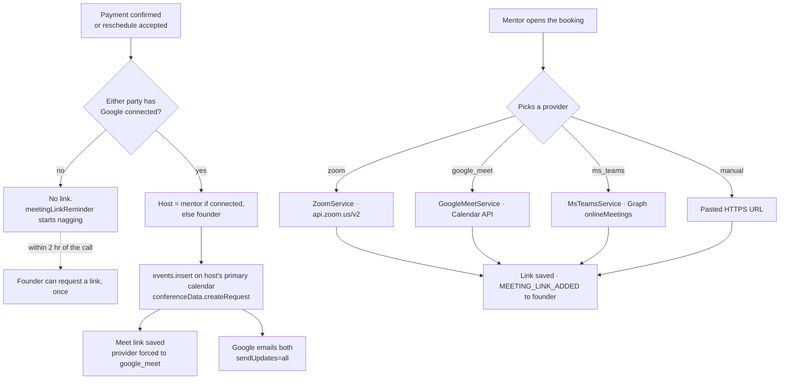

# Meeting links, end to end

How a booking gets a join URL — the two independent paths that produce one, which account
ends up hosting, what happens on reschedule, and the places a link appears or changes
without anyone asking for it.

Traced from `video-conferencing/`, `google-calendar/`, `BookingService.ts` and
`schedule/init/meetingLinkReminder.ts` on 1 Aug 2026.

## The two paths to a link

A booking can get its `meeting_link` two ways, and they do not know about each other.

**Auto-sync is Google-only and best-effort.** `syncBookingToCalendar` fires on payment
confirm and again when a reschedule is accepted. It is wrapped in a try/catch that logs and
returns, so a Google outage never blocks a payment — the booking simply confirms with no
link and the reminder cron takes over.

## What each provider needs

| Provider | Auth | API | Consent needed from |
|---|---|---|---|
| Google Meet | OAuth, refresh token | Calendar `events.insert` with `conferenceSolutionKey: hangoutsMeet` | Each mentor individually |
| Zoom | OAuth, refresh token | `api.zoom.us/v2` | Each mentor individually |
| MS Teams | OAuth, refresh token | Graph `onlineMeetings` | Each mentor individually |
| Manual | none | none | nobody |

Google is asked for `calendar.readonly`, `calendar.events` and `userinfo.email`
(`GoogleCalendarService.ts:9`). Teams asks for `OnlineMeetings.ReadWrite offline_access
User.Read`.

**The calendar scopes are the slow ones.** `calendar.readonly` and `calendar.events` are
sensitive, so the OAuth app needs Google's verification before mentors outside the test-user
list can consent. Until that clears, an unverified app still works for up to 100 accounts
added as test users on the consent screen, and `manual` works for everyone.

**A Meet link cannot be created from an email address alone.** Host ownership follows the
OAuth token. There is no API that mints a link owned by an account you do not hold a grant
for, and Workspace domain-wide delegation only reaches accounts inside your own domain — not
a mentor's personal Gmail. Making the mentor the host will always require the mentor to
connect.

## Who ends up hosting

| Situation | Host | Consequence |
|---|---|---|
| Mentor connected | mentor | The intended case. Link lives on the mentor's calendar |
| Mentor not connected, founder is | founder | Link is owned by the founder's account |
| Neither connected | nobody | No auto link at all |
| Reschedule of an existing event | whoever hosted it originally | Read from `meta.google_calendar_host_user_id` |

The chosen host is recorded on the booking's `meta` alongside the event id, and reschedules
patch that calendar rather than re-picking.

## The reminder and request path

When no link exists, two things chase it:

- `meeting-link-reminder` emails the mentor on confirm, once a day, at 1 hr and at 10 min —
  and stops the moment a link appears.
- The founder gets a **Request meeting link** button, but only inside 2 hr of the call, and
  only once per booking. The one-shot guard is a `MEETING_LINK_REQUESTED` activity row.

## Things the names do not tell you

### The founder can silently become the host

`syncBookingToCalendar` falls back to the founder when the mentor has not connected Google,
so a mentor's booking can produce a Meet link owned by the founder's account — including
the ability to admit or eject people. Nothing in the UI says who hosts.
`BookingService.ts:511`.

### A reschedule can overwrite a manual or Zoom link with a Meet link

Reschedule updates the same booking row and calls `syncBookingToCalendar` again. If the
mentor had added a Zoom or manual link, there is no `google_calendar_event_id` in `meta`, so
the sync takes the create branch: it makes a fresh Google event, overwrites `meeting_link`
and forces `meeting_provider` to `google_meet`. The mentor's chosen provider is discarded
without a message.

### The host is frozen at first sync

`meta.google_calendar_host_user_id` is written once. If the founder hosted because the
mentor had not connected, every later reschedule keeps patching the founder's calendar even
after the mentor connects.

### Auto-sync failure is invisible to both parties

The whole sync sits in a try/catch that only writes to the log. Users see a booking with no
link and no explanation, which is indistinguishable from a mentor who has not got round to
it. Look for `Failed to auto-sync booking to Google Calendar` in the API logs.

### The invited address is not always the login email

`resolveAttendee` prefers `google_calendar_email` — the account the calendar actually sits
on — and only falls back to the ScaleDux login. A mentor who signed up with one address and
connected Google with another is invited at the second.

### The founder's link request cannot be repeated

The one-per-booking guard is an activity row, not a time window. If the mentor ignores the
first request, the founder gets `Meeting link request already sent` forever and has no way
to chase again.

### Manual links must be HTTPS

`addMeetingLink` rejects anything not starting with `https://`. A pasted `http://` or a bare
`meet.google.com/abc-defg` is refused.

## If verification is the blocker

Four ways out, in order of how fast they land:

1. **Test users.** Add mentors to the OAuth consent screen's test list — sensitive scopes
   work immediately for up to 100 accounts, with an "unverified app" warning.
2. **One ScaleDux host account.** Stop asking mentors for OAuth. Create every event on a
   single ScaleDux calendar with both parties as attendees. One consent, which you control,
   and an app marked Internal to a Workspace org needs no verification at all. Cost: the
   mentor is an attendee, not the owner.
3. **Narrower scopes.** Dropping `calendar.readonly` shrinks the review surface if reading
   mentor availability can wait. `calendar.app.created` and the Meet API's
   `meetings.space.created` are narrower still — check their current verification tier in
   the Cloud console before committing, as Google reclassifies these.
4. **Zoom in the meantime.** Server-to-server OAuth issues links from API credentials with
   no per-user consent.
