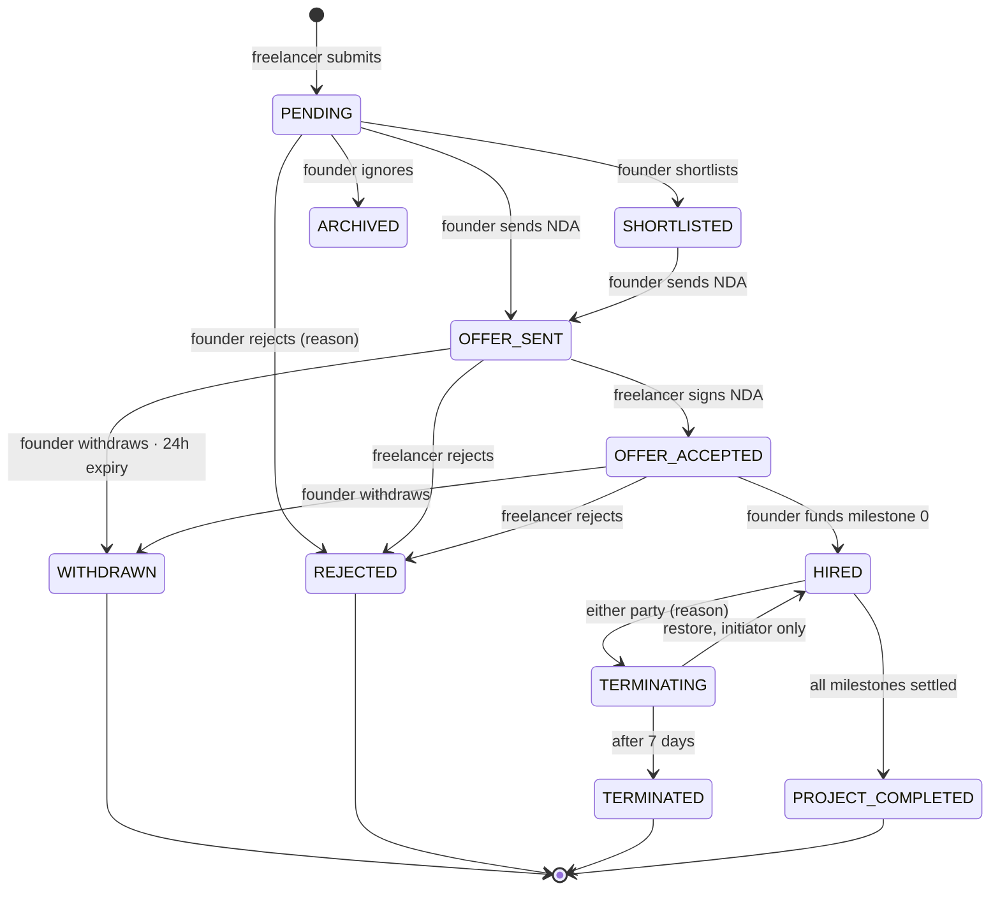

# The proposal lifecycle, end to end

Every state a proposal can hold, who moves it, what the project does alongside it, and
the places the code does something you would not guess from the status name.

Traced from `ProposalService.ts`, `BillingController.ts`, `MilestoneService.ts`,
`DeliverableService.ts` and `src/schedule/init/` on 16 Jul 2026.

## The state machine

Eleven live states. Four are terminal.

**Payment is the hinge.** `HIRED` is reachable only by funding milestone 0, so it is the
one status that proves money moved. Everything before it is reversible by either side;
everything after it goes through terminate.

## Who moves what

| Transition | Actor | Requires |
|---|---|---|
| → `PENDING` | freelancer | Project published. Drafts also sit at PENDING, hidden by `is_draft`. |
| → `SHORTLISTED` | founder | — |
| → `ARCHIVED` | founder · system | Silent ignore. Bulk-set when a project is unpublished. |
| → `REJECTED` | founder | Reason required. |
| → `OFFER_SENT` | founder | Uploads NDA. One active offer per project. |
| → `OFFER_ACCEPTED` | freelancer | Signs NDA. Verified bank + Razorpay account. |
| → `HIRED` | founder | Funds milestone 0. |
| → `WITHDRAWN` | founder · cron | Reason required. **Now also allowed at OFFER_ACCEPTED.** |
| → `REJECTED` | freelancer | Reason required. **Now also allowed at OFFER_ACCEPTED.** |
| → `TERMINATING` | either party | Only from HIRED. Reason required. |
| → `TERMINATED` | cron | 7 days after termination is scheduled. |
| → `PROJECT_COMPLETED` | founder · auto | Every milestone paid or completed. |

## What the project does alongside

The project has its own status, coupled to the proposal at exactly three moments.

| Project status | Set when | Meaning |
|---|---|---|
| `PUBLISHED` | Founder publishes — and stays here through the whole offer dance | Open to proposals. |
| `IN_PROGRESS` | Milestone 0 funded **(changed)** | Someone is being paid to work on this. |
| `PUBLISHED` | Contract terminates | Back on the market. |
| `COMPLETED` | Project completed | Terminal, atomic with `PROJECT_COMPLETED`. |

> **This changed on 16 Jul 2026.** The project used to go `IN_PROGRESS` the moment the
> freelancer signed the NDA — before any money moved. So it left the market on a promise,
> and `IN_PROGRESS` could not be read as evidence of payment. It now moves at the hire.
>
> Read `IN_PROGRESS` as "some proposal here is paid for" — which is why withdrawing an
> unpaid offer deliberately leaves project status alone.

## After the hire

Milestones run on two independent axes: a `status` and a `payment_status`. Deliverables
drive both.

- Founder approves milestone scope → the milestone locks (`is_approved`).
- Founder funds it → `payment_status: FUNDED`, money sits in escrow, `on_hold`.
- Freelancer submits a deliverable → `SUBMITTED`. Founder approves, or a cron
  auto-approves after 48h.
- All deliverables approved → milestone `COMPLETED`. Founder releases → `RELEASED` / `PAID`.
- All milestones settled → 48h later the project auto-completes, if anything happens to
  read it.

## The scheduled jobs that touch this

| Job | Cadence | Does |
|---|---|---|
| `offer-auto-expiry` | `*/15` | Unsigned offer past 24h → `WITHDRAWN` |
| `scheduled-contract-termination` | `*/15` | `TERMINATING` → `TERMINATED`, republishes project |
| `deliverable-auto-approve` | `*/15` | Deliverable stuck 48h in `SUBMITTED` → approved |
| `invoice-auto-approve` | `*/15` | Approves invoices — and quietly drives project auto-completion |

A fifth job, `scheduled-termination`, deletes user accounts. It is unrelated to contracts
despite the name.

## Things the names do not tell you

### A captured payment can leave the proposal unhired

`HIRED` is written only when the browser calls back to `/billing/verify-payment`. The
Razorpay webhook never touches proposal status. If that call is lost — closed tab, dropped
network — the money is taken and the proposal sits at `OFFER_ACCEPTED` with nothing to
reconcile it.

### No transition is illegal

`updateProposalStatus` validates the target status and the caller's ownership. It never
looks at the current status — so a `HIRED` or `TERMINATED` proposal can be driven back to
`SHORTLISTED`. There is no transition table anywhere in the codebase; the diagram above is
what the code *intends*, not what it enforces.

### "Request changes" is not a status

It writes an activity row and some remarks. The proposal stays `PENDING`, so nothing in
the status distinguishes a proposal awaiting changes from one nobody has touched. Editing
it clears the remarks.

### Not answering in 24h is recorded as withdrawal

An expired offer lands on `WITHDRAWN` — the same status as a founder yanking it. That
status permanently blocks re-inviting the freelancer to the project. Someone who was
simply asleep is treated like someone whose offer was pulled.

### Offers without an NDA never expire

`offer_expires_at` is derived from `nda_sent_at`, and the expiry job filters on
`is_nda_signed: false`. A no-NDA project's offer has neither, so it sits at `OFFER_SENT`
forever — even though the job writes copy for exactly that case.

### A milestone can be marked paid with no transaction

`performMilestoneRelease` looks up the escrow row, then releases. If it finds nothing,
there is no `else` — the milestone is still stamped `RELEASED` / `PAID`.

### Archived proposals lie to the freelancer

`ARCHIVED` is rewritten to `PENDING` when the freelancer reads it. From their side, an
ignored proposal is indistinguishable from one still under consideration.

### Activities are queued, not written

Every activity goes through a job queue, so feed rows lag the status write and vanish if
the worker drops the job. The feed is a narration of the lifecycle, not a record of it.

## Dead states

Declared in the enum, written by nothing:

- `DECLINED`
- `OFFER_REJECTED`
- `InviteStatus.IGNORED`
- `MilestoneStatus.IN_PROGRESS`

`OFFER_REJECTED` is the trap: it reads as the status a rejected offer would take, but
`declineOffer` writes plain `REJECTED`. The UI checks for both.

## Invitations are a separate track

A founder inviting a freelancer creates a `ProjectInvite`, not a proposal. Accepting the
invite marks it `ACCEPTED` and nothing else — the freelancer still has to submit a
proposal to enter the lifecycle above. The two tracks touch at one point: creating a
proposal marks any matching pending invite as accepted.
